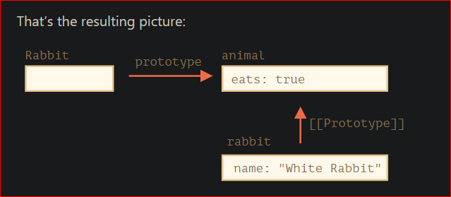
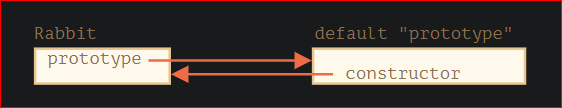

Please note that F.prototype here means a regular property named "prototype" on F. It sounds something similar to the term “prototype”, but here we really mean a regular property with this name.

```javascript
let animal = {
  eats: true,
};

function Rabbit(name) {
  this.name = name;
}

Rabbit.prototype = animal;

let rabbit = new Rabbit("White Rabbit"); //  rabbit.__proto__ == animal

alert(rabbit.eats); // true
```



On the picture, "prototype" is a horizontal arrow, meaning a regular property, and `[[Prototype]]` is vertical, meaning the inheritance of rabbit from animal.

**Important:** Setting Rabbit.prototype = animal literally states the following: "When a new Rabbit is created, assign its `[[Prototype]]` to animal".

Notice in below example how the old object retains prototype having empty object.

```javascript
let animal = {
  eats: true,
};

function Rabbit(name) {
  this.name = name;
}

let myrabbit = new Rabbit("Kartik dandborha");

console.log(`${JSON.stringify(myrabbit.__proto__)}`);

Rabbit.prototype = animal;

console.log(`${JSON.stringify(myrabbit.__proto__)}`);

let newRabbit = new Rabbit("New proto vala rabbit");
console.log(`${JSON.stringify(newRabbit.__proto__)}`);
```

Output:

```
PS D:\Try> node try.js
{}
{}
{"eats":true}
```

---

Every function has the "prototype" property even if we don’t supply it.

The default "prototype" is an object with the only property constructor that points back to the function itself.

Like this:

```javascript
function Rabbit() {}

/* default prototype
Rabbit.prototype = { constructor: Rabbit };
*/
```


